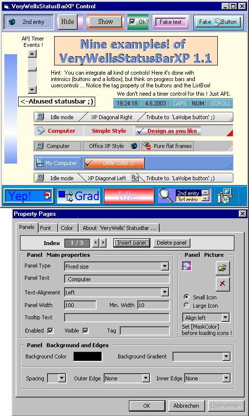



## VeryWellsStatusBarXP Rel\. 1\.1

### Description

=> VeryWellsStatusBarXP - Sorry folks for my upload mistake! For new release 1.2 (6/10/2003) with fine new feature plz goto ___ http://www.planet-source-code.com/vb/scripts/ShowCode.asp?txtCodeId=45877&lngWId=1 

----

All votes are welcome - thx !
 
### More Info
 

             |
---                |---
**Submitted On**   |2003-06-04 14:00:48
**By**             |[Light Templer](https://github.com/Planet-Source-Code/PSCIndex/blob/master/ByAuthor/light-templer.md)
**Level**          |Advanced
**User Rating**    |5.0 (45 globes from 9 users)
**Compatibility**  |VB 5\.0, VB 6\.0
**Category**       |[Custom Controls/ Forms/  Menus](https://github.com/Planet-Source-Code/PSCIndex/blob/master/ByCategory/custom-controls-forms-menus__1-4.md)
**World**          |[Visual Basic](https://github.com/Planet-Source-Code/PSCIndex/blob/master/ByWorld/visual-basic.md)
**Archive File**   |[VeryWellsS159662642003\.zip](https://github.com/Planet-Source-Code/light-templer-verywellsstatusbarxp-rel-1-1__1-45939/archive/master.zip)

